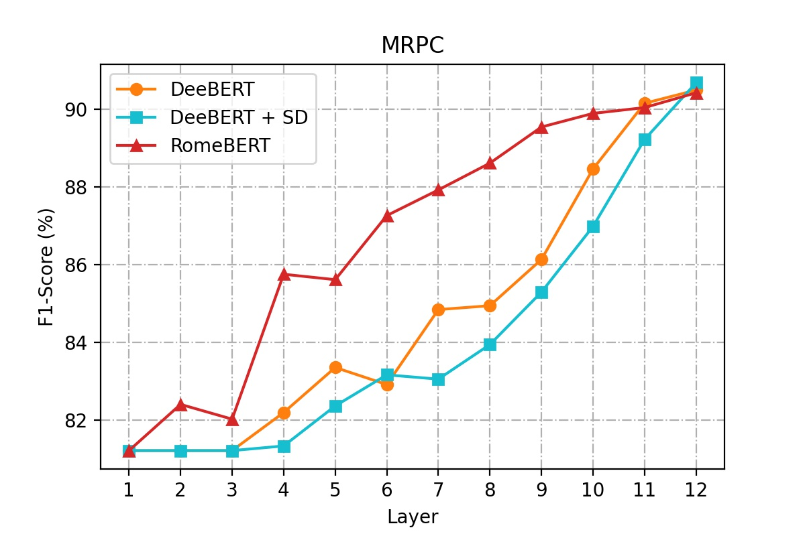
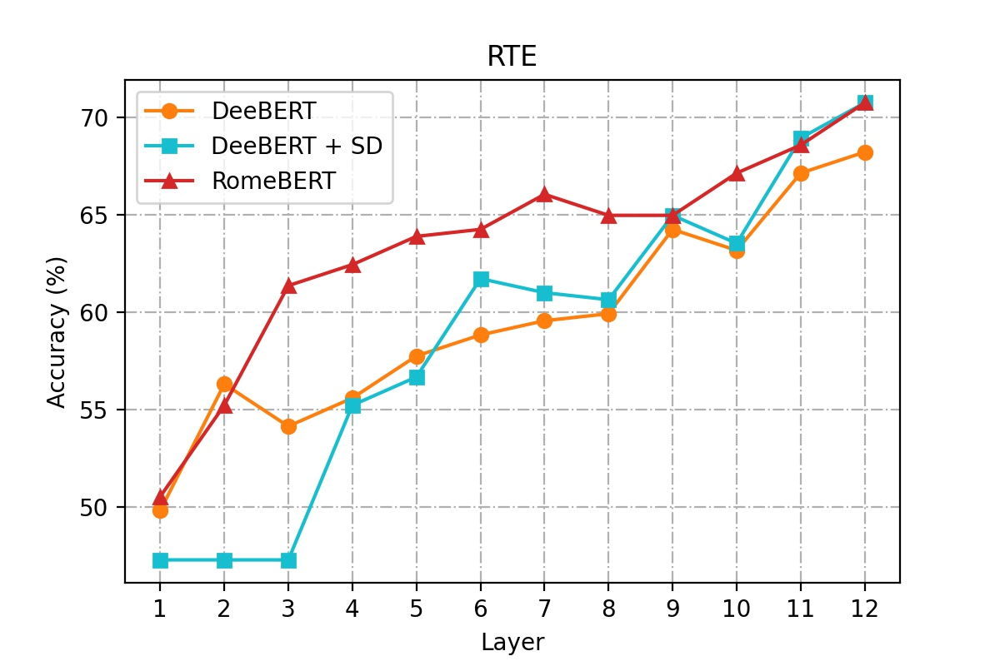
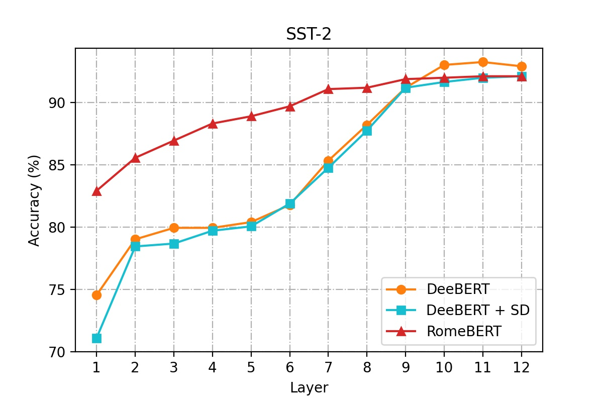
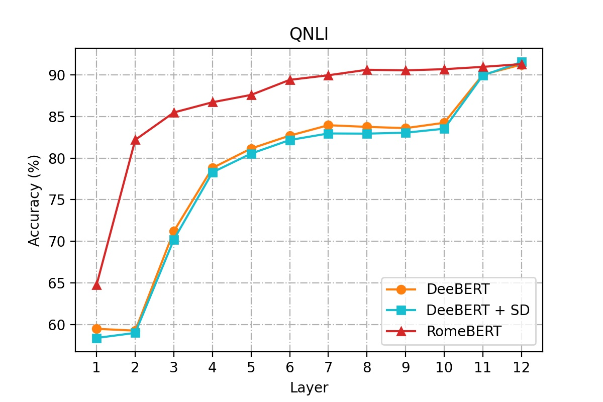

# DeeBERT + SD


## Installation

This repo is tested on Python 3.7.7, PyTorch 1.4.0, and Cuda 10.1. Using a virtulaenv or conda environemnt is recommended, for example:

```
conda install pytorch==1.4.0 torchvision cudatoolkit=10.1 -c pytorch
```

After installing the required environment and cloning this repo, install the following requirements:

```
pip install -r ./requirements.txt
pip install -r ./examples/requirements.txt
```

Download GLUE dataset by

```
python download_glue_data.py --data_dir data --tasks all
```

## Comparison with raw DeeBERT & RomeBERT










## Usage


Scripts are in the `scripts` folder, which corresponds to `DeeBERT + SD`. 
The revised model is in `transformers/modeling_highway_bert.py`.


#### train_highway.sh

This is for fine-tuning `DeeBERT + SD` models.

#### eval_highway.sh

This is for evaluating each exit layer for fine-tuned `DeeBERT + SD` models.

#### eval_entropy.sh

This is for evaluating fine-tuned `DeeBERT + SD` models, given a number of different early exit entropy thresholds.

